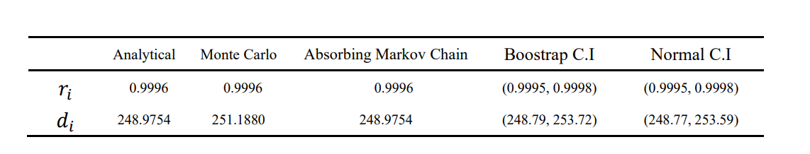

"# Gambler-s_Ruin_Markov_Chain" 

實作 Absorbing Markov Chain 與 Monte Carlo 方法，驗證該模型之解析解，並建構 95% 信賴區間。

數學 x Skinner Box(獎勵、間歇性強化、再強化機制) x Csíkszentmihályi 心流的策略思考

RTP與公司利潤之間 Trade-off

以Python / Cython / C++ 實作 Monte Carlo 方法，最終 C++ 版本(約0.133s)加速至原始 Python 版本(約6.128s)的 46 倍。

